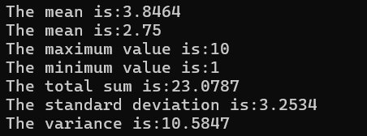
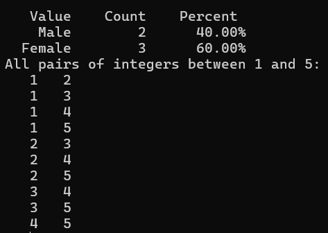

# Overview
With this package, a few answers had to be answered to futhur understand this package  

## What purpose does it serve?
The purpose for this package is to analyse statistical values. There is a lot of options that one can do, but here are a few exapmles.

1.  Given a vector x, one can calculate basic statistical values.  
 ```m
disp(strcat("The mean is: ",num2str(mean(x))));
disp(strcat("The mean is: ",num2str(median(x))));
disp(strcat("The maximum value is: ",num2str(nanmax(x))));
disp(strcat("The minimum value is: ",num2str(nanmin(x))));
disp(strcat("The total sum is: ",num2str(nansum(x))));
disp(strcat("The standard deviation is: ",num2str(std(x))));
disp(strcat("The variance is: ",num2str(var(x)),"\n"));
```



2.  Data Manipulation 
```m
pkg load statistics;
gender = ["Male"; "Male"; "Female"; "Female"; "Female"];
tabulate(gender)
temp = combnk (1:5, 2);
disp ("All pairs of integers between 1 and 5:");
disp (temp);
```
  

## Addional Comments
Like some students in CS2613, I am currently taking statistics for engineers. Using some software to analyse different statistics problems can be benificial for learning purposes. This is the main reason why I chose this package, which was created September 30, 2022. I use octave/MATLAB every week so it was interesting to see that I can also use the software/coding language for another class.  
This package has not really influenced my learning in octave, since I am confortable to code in this language. I mostly just realised that this coding language has alot of functionality. My overall experience with this package was neutral, I do not like statistics at all, so it was not interesting for me, but it was cool to see that I can use MATLAB for statistics. I would recommend this package for any engineers that are taking the class and is confortable with MATLAB/octave. I will not continue using this package since hopefully, this is the last time that I will be taking the course, so this package would not have any benefits for me anymore. 