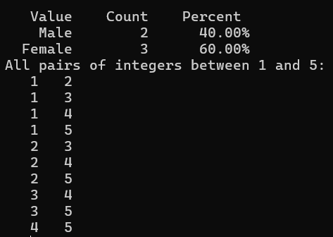

# statistics.m
Statistics.m is a free open-source toolkit used for calculating statistics of your data. It can do many basic functions in statistics such as simple descriptive statistics, distributions, curve fitting and even a bit of machine learning.

## Installation 
One can install statistics.m using the following command in the command prompt
```m
pkg install -forge statistics
```

## Purpose
With this package, there a many different operations that can be done. A few examples can be seen below

### Simple statistics
```m
disp(strcat("The mean is: ",num2str(mean(x))));
disp(strcat("The mean is: ",num2str(median(x))));
disp(strcat("The maximum value is: ",num2str(nanmax(x))));
disp(strcat("The minimum value is: ",num2str(nanmin(x))));
disp(strcat("The total sum is: ",num2str(nansum(x))));
disp(strcat("The standard deviation is: ",num2str(std(x))));
disp(strcat("The variance is: ",num2str(var(x)),"\n"));
```

### Data Manipulation
```m
pkg load statistics;
gender = ["Male"; "Male"; "Female"; "Female"; "Female"];
tabulate(gender)
temp = combnk (1:5, 2);
disp ("All pairs of integers between 1 and 5:");
disp (temp);
```

### Output




## References
[1] The Statistics Package for GNU Octave on GitHub [https://github.com/gnu-octave/statistics/?tab=readme-ov-file](https://github.com/gnu-octave/statistics/?tab=readme-ov-file)  
[2] The Statistics Package Documentation [https://gnu-octave.github.io/statistics/](https://gnu-octave.github.io/statistics/)